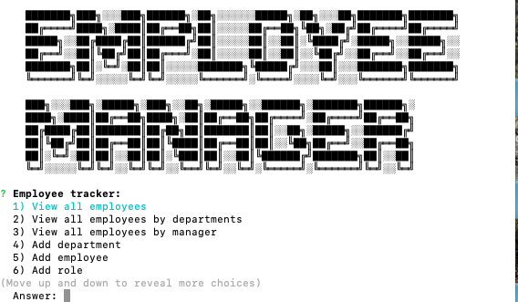

# Unit 12 MySQL Homework: Employee Tracker
Description: 
As a business owner, I want to be able to view and manage the departments, roles, and employees in my company, so that I can organize and plan my business.

Links:
https://github.com/KokhobYohannes/EmployeeManager 

Usage:
1) Run npm i
2) Run "node server.js" to start the program.

Screenshot:

Acknowledgements: 
1) Employee Manager Text: https://fsymbols.com/generators/tarty/
2) Worked with a tutor to troubleshoot sql issues  
3) User story in the description provided by GWU